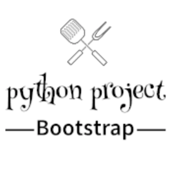

<!-- markdownlint-disable -->
<h1 align="center" style="margin:1em">
  
</h1>

<h4 align="center">
  Basic scaffolding for a new project in Python
</h4>

  
  
  
  

 

## Main Features

- **Dev friendly**: a Makefile will allow to quickly setup everything with `make init`, and also to run tests, see coverage and display your environment vars
- **Configuration through environement variables** in a `.env` file (only for PYTHONPATH in this bootstrap)
- **Automated** testing and deployment: connected to Travis and Codecov. You will find the usual suspects here:
    - `flake8` for conventions
    - `pytest` for testing
    - `coverage` for test coverage
- **Out-of-the-box CLI** thanks to `docopt`
- **Loaded with bonuses**, available through an utils package to take care of logging, env vars, loading of csv and yaml, running commands

## A note on bonuses 

### Utils & tests

A few helpers are included in this repo, more for illustration than anything else, a bit for (my) conveniency also...

A few tests come along with them, only to make the scaffolder more readable, and to give you some practical examples.

It's up to you to raise the coverage ratio, or not. And to trash what you will not use.

### Something is missing ?

Head to [githup issues](https://github.com/ebreton/flaskbootstrap/issues) and submit one ! Be sure to have a look at the [CONTRIBUTING.md](./docs/CONTRIBUTING.md) guide before

## Install and Usage

Check out [INSTALL.md](./docs/INSTALL.md) for more details

## Changelog

All notable changes to this project are documented in [CHANGELOG.md](./docs/CHANGELOG.md).

## Contribution

Check out [CONTRIBUTING.md](./docs/CONTRIBUTING.md) for more details

As well as our [CODE_OF_CONDUCT.md](./docs/CODE_OF_CONDUCT.md), where we pledge to making participation in our project and our community a harassment-free experience for everyone
